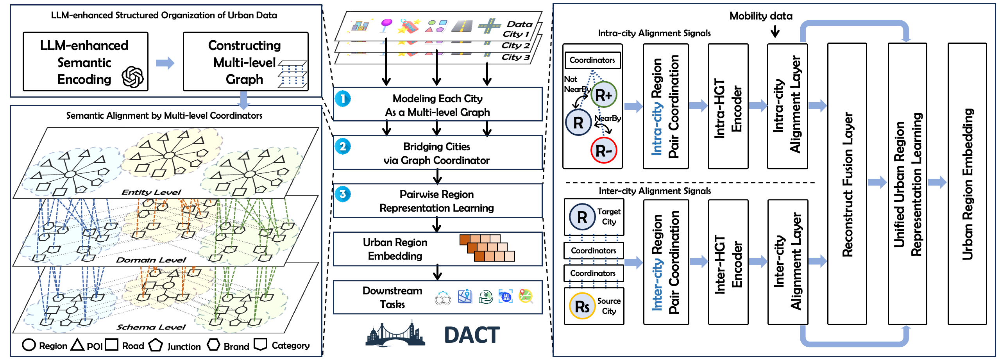

<!-- # DACT -->

<!-- PROJECT LOGO -->
<br />
<div align="center">
    
</div>


<h2 align="center"> Data-centric Cross-city Knowledge Transfer for Regional Socioeconomic Prediction </h2>

<div align="center">

| **[Overview](#overview)** | **[Requirements](#requirements)** | **[Quick Start](#quick-start)** | **[Dataset](#Dataset)** |

</div>

Urban region representation learning is essential for regional socioeconomic prediction, enabling intelligent applications like crime forecasting, GDP predicting and urban planning. However, generalizing these representations to data-scarce cities remains a challenge due to severe spatial semantic heterogeneity. Existing embedding-centric approaches typically employ a decoupled strategy: they first learn city-specific representations independently and then attempt to align them via post-hoc mapping functions. This process often results in limited transferability, as the initial embeddings in data-scarce cities are inherently noisy and structurally incompatible.  In response, we propose **DACT**, a novel *data-centric* framework that shifts the paradigm from embedding alignment to structural data alignment prior to learning. **DACT** constructs a shared spatial semantic graph by leveraging large language models (LLMs) as semantic bridges to resolve heterogeneity across schema, domain, and entity levels. Furthermore, we introduce a pairwise region coordination learning mechanism to enable robust and efficient knowledge transfer. This strategy jointly captures intra-city specificity and inter-city generalities by modeling region pairs, offering a scalable solution that avoids the computational bottlenecks of complex graph matching while preserving fine-grained structural details. Extensive experiments on NYC, Chicago, and Shenzhen across five prediction tasks demonstrate that **DACT** significantly outperforms state-of-the-art baselines, achieving 17.1\% MAE reduction and 199.7\% $R^2$ improvement in low-resource settings. These results validate the superiority of the data-centric paradigm for robust regional socioeconomic prediction.


## Overview

The Overview of **DACT** is shown as follows:



<!-- 1. **Multi-level Graph**: Structures multi-city urban data into a unified heterogeneous graph with shared schema types but city-specific instances.
2. **Bridging Cities**: Leverages LLMs to establish semantic correspondences across cities at both schema and domain levels.
3. **Pairwise Region Coordination**: Enables scalable training by jointly modeling intra-city specificity and inter-city commonalities through selective region sampling. -->

<!-- [//]: # (More details to come after accepted.) -->

## Requirements
- python==3.8.8
- pytorch==1.13.1
- numpy==1.23.5
- dgl==2.2.1
- pandas==1.5.2

## Quick Start

### Code Structure
```bash
├── DACT_logo.png
├── overview.jpg
├── README.md
├── args.py
├── data--------------------------data for training and evaluation
│   ├── README.md
│   ├── nyc
│   ├── chi
│   └── lmargs.py
├── function----------------------some functions
│   ├── downstream_task.py
│   ├── llm_agent.py
│   ├── load_graph_data.py
│   ├── load_graph_data_list.py
│   ├── logger.py
│   └── tools.py
├── model-------------------------models
│   ├── DACTModel.py
│   ├── HGTInter.py
│   └── HGTIntra.py
└── train.py----------------------main training script
```

### Prompt

#### Entity Level - $l2$
- POI
```
Describe this POI. It is a {\textit{Category}} named {\textit{Name}}, operated by the brand {\textit{Brand}}, and located at ({\textit{Latitude}}, {\textit{Longitude}}). Incorporate its category, precise location, and any other attributes that clarify its role in the urban environment.
```
- Road
```
Describe this road. It is a {\textit{Type}} road and its geometry is represented as {\textit{Geometry}}. Incorporate its type, precise location, and any other attributes that clarify its role in the urban environment.
```
- Junction
```
Describe this junction. It is a {\textit{Category}} junction located at ({\textit{Latitude}}, {\textit{Longitude}}). Incorporate its category, precise location, and any other attributes that clarify its role in the urban environment.
```
- Region
```
Describe this region. It is a {\textit{Category}} region with boundary {\textit{Boundary}}. Incorporate its category, precise location, and any other attributes that clarify its role in the urban environment.
```

#### Domain Level - $l1$
- Category
```
Describe this {\textit{POI/Junction/Road}} category. It is {\textit{Category}}. Analyze its universal definition and common characteristics that remain consistent across different cities, while also identifying any location-specific variations in function, usage patterns, or cultural significance that may vary between urban contexts.
```
- Brand
```
Describe this POI brand. It is {\textit{Brand}}. Analyze its brand identity, core business model, and standardized characteristics that maintain consistency across cities, while also examining how local market conditions, cultural preferences, or regulatory environments may influence its specific manifestations in different urban contexts.
```

#### Schema Level - $l0$
```
This is a Schema node representing {\textit{POI/Junction/Road/Region/Category/Brand}} in the city, serving as a common hub across cities. Please describe its role and significance.
```

### Training
Brefore running the training script, you can modify the hyperparameters and configurations in `args.py` and `data/lmargs.py` as needed.

To train the model, run the following command:

```bash
python train.py
```

## Dataset

Urban Region Graph (in the format of triples):
  - `data/nyc/mht180_prepared.csv`
  - `data/chi/chi869_prepared.csv`
  - ...

We will provide further data after the paper is accepted.

<!-- [//]: # (More details to come after accepted.) -->